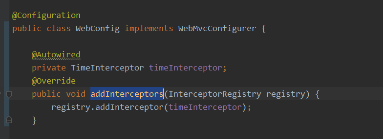
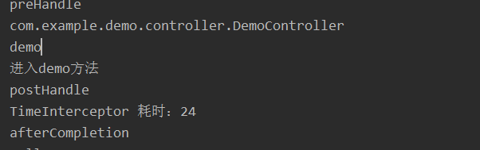
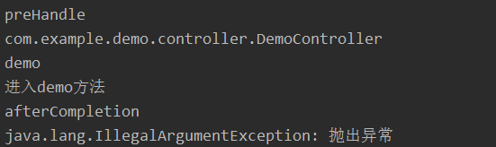

1.编写类实现HandlerInterceptor接口
2.编写java配置类实现WebMvcConfigurer#addInterceptors（）

HandlerInterceptor中#preHandle 在拦截方法前执行，返回true则执行后续流程；#postHandle在被拦截方法执行后且无异常才被执行；#afterCompletion无论有无异常发生都会最后被执行（若异常被处理了例如容器中有被@ControllerAdvice处理的异常，则此方法的异常对象参数为空）

无异常的执行情况

有异常的执行情况

